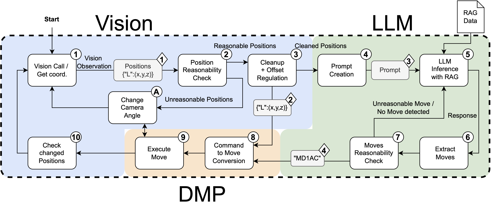

# TOH solver

This directory contains the LLM that solves the game in the green part of the above overview:

# class TowerOfHanoiState:
## __init__(self, json_file_path) 
Initializes the game by loading JSON state and saving the initial state.
## convert_move(self, llm_cmd: str) -> str
Converts compact move code (MD3AC) into a readable format with color (GreenAC).
## load_json(self)
Returns the current state of all pegs as a formatted string.
## apply_move(self, move_code)
Validates and applies a single move; checks move legality and updates the state.
## is_solved(self)
Returns True if all disks are correctly on peg C; else False.
## save_with_moves(self, output_file=None)
Saves the current game state and executed moves to a new JSON file.
## reset_to_initial_state(self)
Resets the game state to its original loaded state.
## validate_move_sequence(self, moves)
Checks a sequence of moves for validity without changing the real game state.

## How they interact
__init__ + load_json → Load the game state from file.

apply_move → Used to progress the game safely.

convert_move + save_with_moves → Log and store move history.

get_current_state_string → Supplies state info to the LLM.

validate_move_sequence → Pre-checks move suggestions before applying.

is_solved → Checks if the end condition is reached.

reset_to_initial_state → Allows retrying or re-evaluating the game.
# USAGE:
### Execute
    python toh_llm.py
## INPUTS
It uses the states as inputs in this format that can also be seen in the example States_positions.json
  
    "states":
    {
    "A": [],
    "B": ["3","2","1"],
    "C": []
     }
## OUTPUTS
Outputs are in desired format and can be altered in the class function 

    class TowerOfHanoiState:
        def save_with_moves(self):

Outputs will be saved in 
    
    States_positions_solution.json

Output-format includes the final state and if wished the estimated positions of the cubes can be updated with mov.py

BUT SCRIPT NEEDS ADAPTATION TO NEW OUTPUT FORMAT THIS WILL ONLY BE IMPLEMENTED IF NEEDED!:

If you want to use this, comment out these lines like shown below_

    class TowerOfHanoiState:
         def save_with_moves(self):
        ...
        self.data["moves"] = self.moves
        #self.data["moves"] = []
        #for move in self.moves:
        #    dmp_move = self.convert_move(move)
        #    self.data["moves"].append(dmp_move)
        #    print(f"Moving {move}: {dmp_move}")
        ...

Structure of JSON files:

Fields(optional): represent the position of the field location where the blocks are going to be placed

Positions(optional): represent the initial positions of the detected cubes

init_states:

states: final states after all movement

moves: moves that will be used to play the game
    
    "fields": {
    "A": {"x": -5,"y": 17,"z": 0},
    "B": {"x": 0, "y": 17,"z": 0},
    "C": {"x": 5, "y": 17,"z": 0 }
    },

    "positions": {
    "1": {"x": -5,"y": 17,"z": 4},
    "2": {"x": -5,"y": 17,"z": 2.5},
    "3": {"x": -5,"y": 17, "z": 0.5}},

    "init_states": {
    "A": [],
    "B": ["3","2","1"],
    "C": []
    },

    "states": {
    "A": [],
    "B": [],
    "C": ["3","2","1"]
     },

    "moves": [
    "BlueBC",
    "RedBA",
    "BlueCA",
    "GreenBC",
    "BlueAB",
    "RedAC",
    "BlueBC"
    ]
 